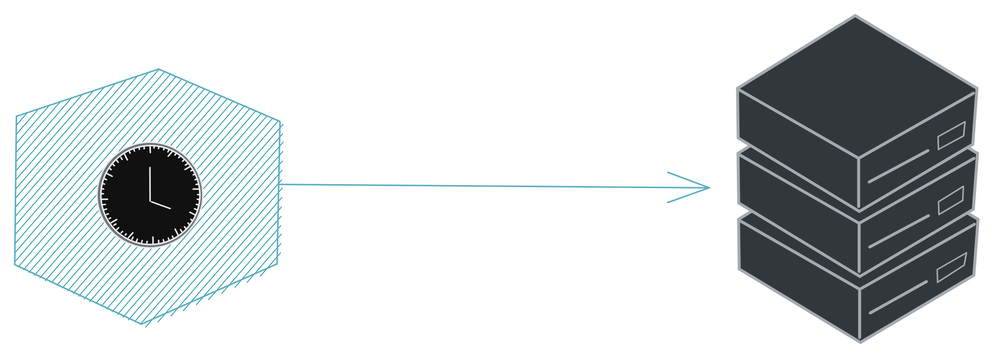
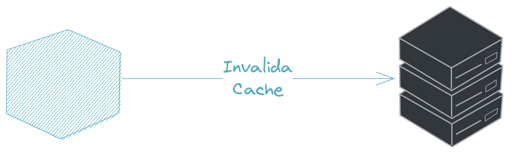
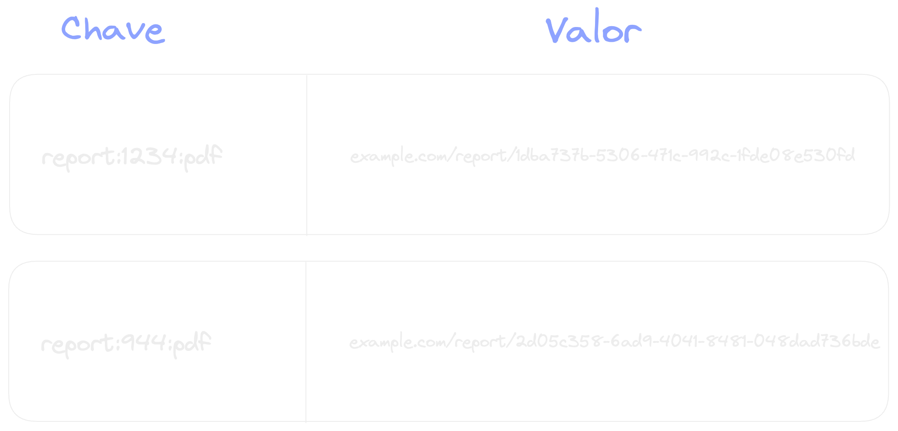
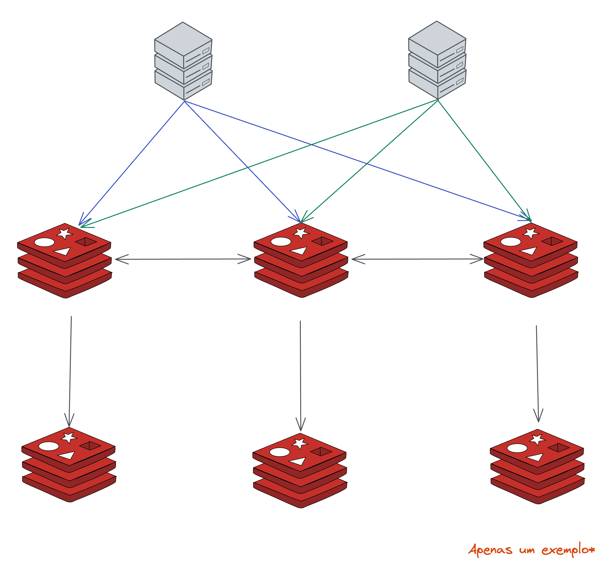
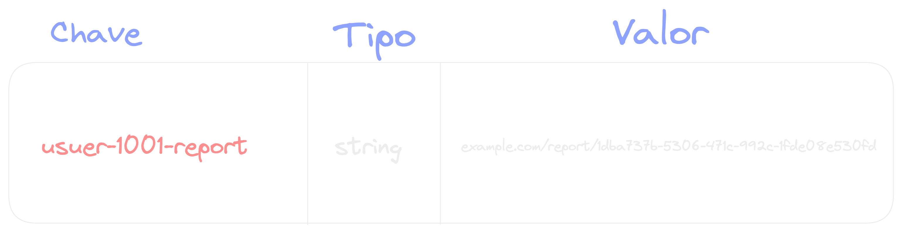
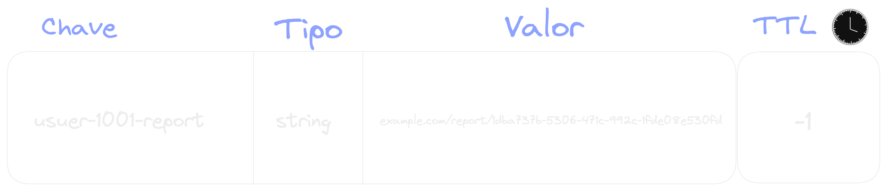
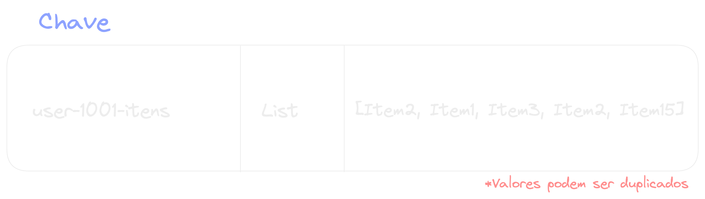
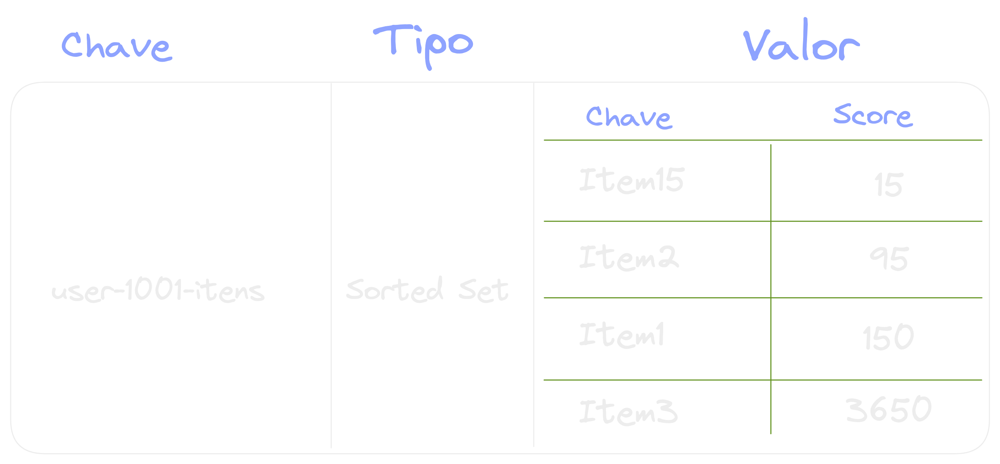
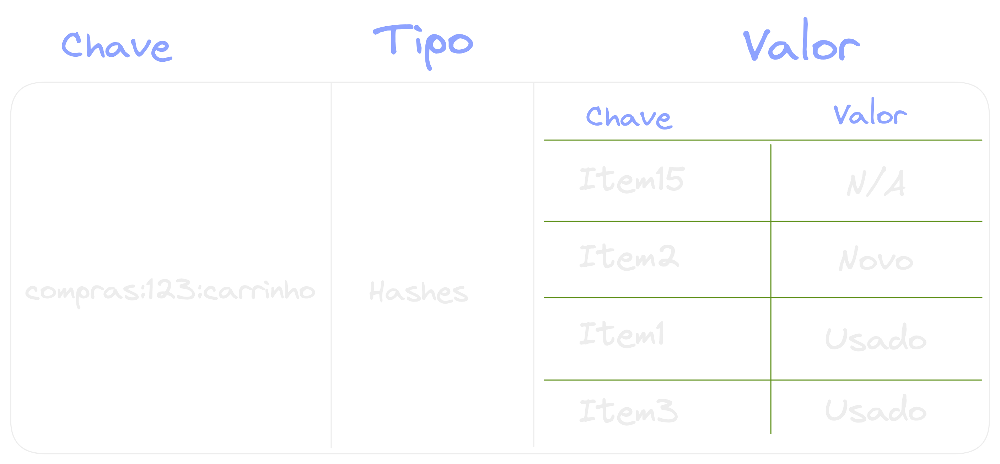

{width=80%}

---

## Qual é a forma mais rápida e barata de processar algo❓ 🤔

---

## É não processar❗️

---

### Cache


---

### Escala horizontal


---

### Como fica o cache?

Principalmente em sistema de fazem login pro session

---

### Ainda não conseguimos compartilhar memória entre servidores

---

### Cache Distribuído

{width=60%}

---

### Invalidar Cache

---

#### Verificação de cache de atualização



---

#### Aplicação Invalidando o Cache



---

#### Expiração por tempo

{width=40%}

---

### E o tal do Redis?

{width=30%}

REmote DIctionary Server

---

### Redis

The open source, **in-memory data store** used by millions of developers as a database, cache, streaming engine, and message broker.

---

### Redis

- Banco de dados Open Sourse
- NoSQL
- Chave valor
- In-memory
- Single-threaded

---

### Chave valor



---

### Pontos de atenção

Reiniciou, perdeu os dados, até da para fazer armazenamento no disco, mas...

---

### Pontos de atenção

{width=65%}

---

### Usos

- Distributed Cache
- Distributed Lock
- Feature Toggle
- Sessoes
- ...

---

### Estratégias de escrita Cache

---

### Pre-caching data

---

### On-demand

---

### Estratégias para invalidar Cache


---

### Verificação programada

---

### Expiração de forma ativa

---

### Expiração por tempo - TTl

{width=50%}

---

### Estruturas de dados

Temos algumas formas de organizar nossas iformações

---

### String


---

### Nome das chaves

`objeto:identificador:campo`

---

### Nome das chaves



---

#### TTL - Tempo de Vida

{width=50%}

---



---


---

### Parâmetros do expire

```
NX -- Set expiry only when the key has no expiry
XX -- Set expiry only when the key has an existing expiry
GT -- Set expiry only when the new expiry is greater than current one
LT -- Set expiry only when the new expiry is less than current one
```

---

### String


---

### Lista

{width=100%}

---

### Sets

{width=100%}

---

### Sorted Sets

{width=100%}

---

### Hash

{width=100%}
