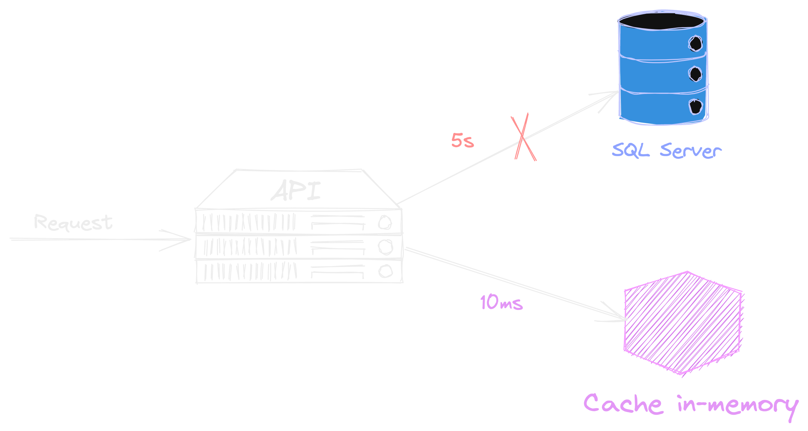
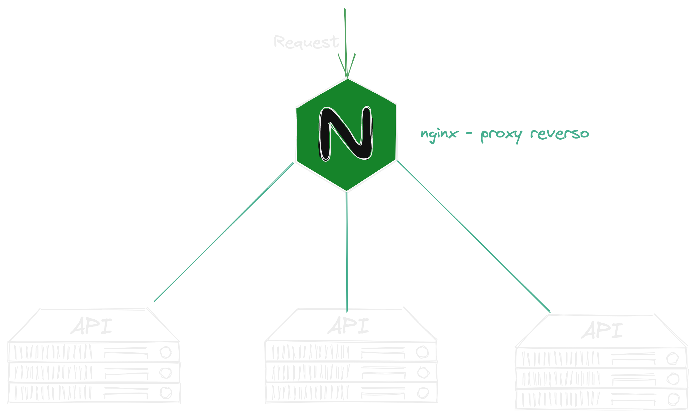
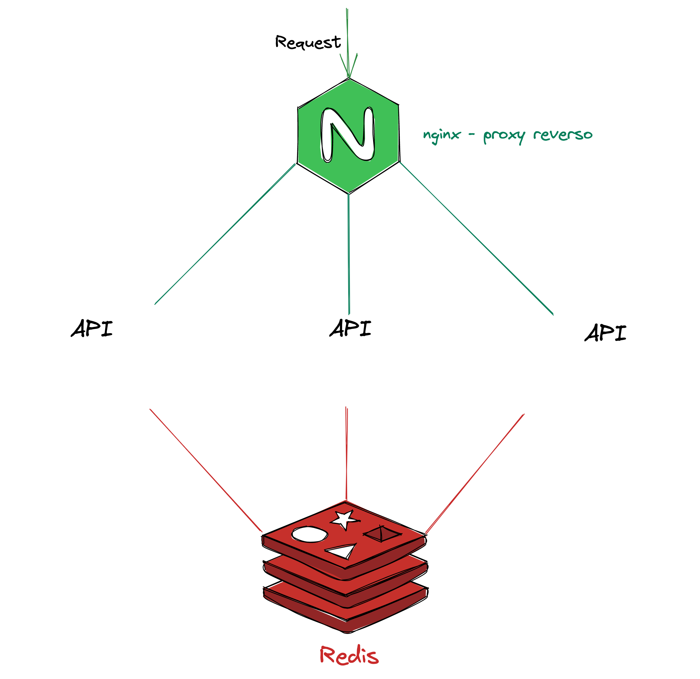
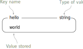
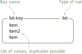
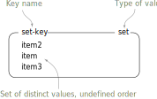
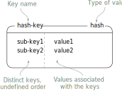
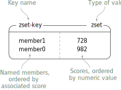

### Redis

{width=60%}

---

## Qual é a forma mais rápida e barata de processar algo❓ 🤔

---

## É não processar❗️

---

### Cache

---

### Escala horizontal

---

### Como fica o cache?

Principalmente em sistema de fazem login pro session

---

### Ainda não conseguimos compartilahr memória entre servidores

---

### Cache Distribuído

{width=60%}

---

### E o tal do Redis?

{width=30%}

REmote DIctionary Server

---

### Redis

- Banco de dados Open Sourse
- In-memory
- Single Thread
- NoSQL
- Chave valor

---

### Chave valor

---

### Estruturas de dados

Temos algumas formas de organizar nossas iformações

---

### String

---

### Nome das chaves

### TTL

---

### Lista

{width=85%}

---

### Sets

{width=85%}

---

### Hash

{width=75%}

---

### Sorted Sets

{width=75%}

---

### Dúvidas?

{ width=90% }
